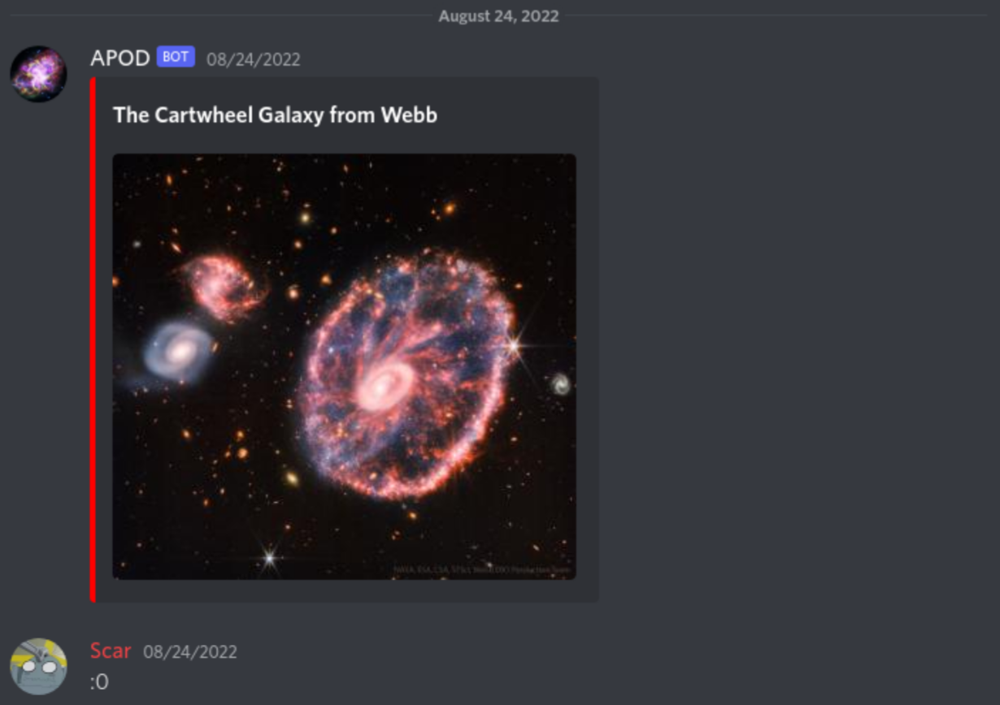

# apod-bot

A discord bot written in [go](https://go.dev/) that fetches and posts NASA's [Astronomy Picture of the Day](https://apod.nasa.gov/apod/).



## Features

- Scheduled posting with `/schedule` and `/stop`
- Manually posting today's picture with `/today`
- Post a random picture with `/random`
- Relive a previous APOD picture with `/specific <date>`
- Get more information with `/explanation`
- Astronomy Picture of the Day API calls are cached
- Today's picture is saved in memory for a faster roundtrip

## Usage

1. Invite the bot to your server.
<https://discord.com/api/oauth2/authorize?client_id=952282891910512663&permissions=18432&scope=applications.commands%20bot>

2. Go to the channel you want APOD messages posted.

3. Call `/schedule <hour UTC>` with the hour you want APOD messages to be sent.

I do keep some metrics of the bot usage. Including but not limited to server names,
channel ids, and command usage. Feel free to self-host it instead!

## Development

`APOD_TOKEN` and `DISCORD_TOKEN` are required as environment variables. These are set in a `.env` file like so:

```text
APOD_TOKEN=<token>
DISCORD_TOKEN=<token>

# Optionally include an owner id to send certain events to.
OWNER_ID=<id>
```

To learn more about discord bot development, visit [discord developers docs](https://discord.com/developers/docs/intro). To create a NASA API token visit [api.nasa.gov](https://api.nasa.gov/index.html#authentication).
